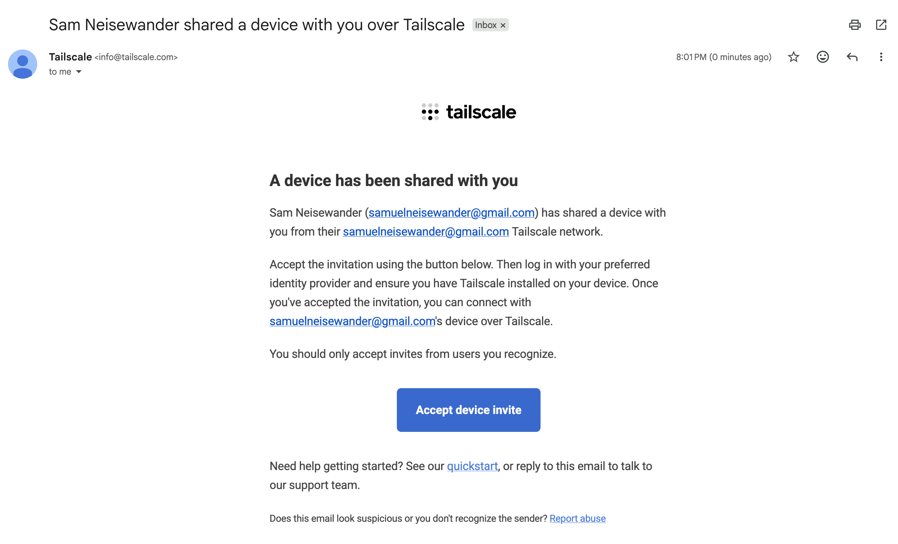
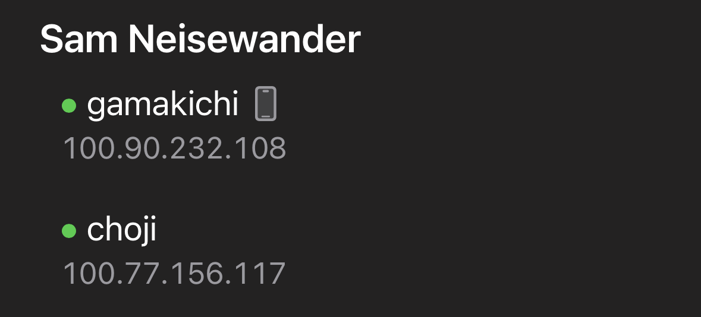

+++
title = "How to use the NAS"
description = "A guide for my family and friends using services on my NAS box."
date = 2026-08-18
lastmod = 2026-08-18
authors = ["Sam Neisewander"]
tags = ["documentation"]
draft = false
+++

## Tailscale

Tailscale is a VPN. It protects the services on the NAS from the public
internet.

First, install Tailscale:

- [Download on macOS or Windows](https://tailscale.com/download)
- [Download on iOS](https://apps.apple.com/us/app/tailscale/id1470499037)

Start the application and create an account. If you receive a prompt asking to
"Add VPN configurations", accept it.

Next, check your email inbox for an email from info@tailscale.com that looks
like this: 

If you didn't receive this email or can't find it, please let me know and I can
send you another one.

Once you accept the invitation, you should see a device named `choji` appear in
the device list: 

Note that my list has lots of devices, because I have done this setup process on
my phone, laptop, and iPad. As you install Tailscale on more of your devices,
you will see them appear in your list as well.

Now, you should be able to access private services on the NAS! As a test, try
opening [immich.vpn.neisewander.com](https://immich.vpn.neisewander.com)

> Note: I have things configured such that any website ending in
> `vpn.neisewander.com` is only accessible while the VPN is active.

If you were already using services like Immich or Nextcloud prior August 2026,
please sign out and sign back into these applications using the new server URLs:

| Service   | Old URL                              | New URL                               |
| --------- | ------------------------------------ | ------------------------------------- |
| Immich    | https://immich.samneisewander.com    | https://immich.vpn.neisewander.com    |
| Nextcloud | https://nextcloud.samneisewander.com | https://nextcloud.vpn.neisewander.com |
| Jellyfin  | https://jellyfin.samneisewander.com  | https://jellyfin.vpn.neisewander.com  |
