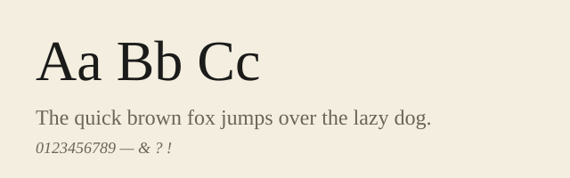

+++
title = "Notes on Typography and Measure"
description = "On line length, the 80-character measure, and why a narrow column is easier to read."
date = 2026-06-10T08:00:00-05:00
lastmod = 2026-06-10T08:00:00-05:00
authors = ["Sam Neisewander"]
tags = ["design", "typography"]
draft = false
+++

A column of text is easier to read when each line is short enough that your eye
can find the next line without effort. Typographers call this the *measure*.

## The 80-character rule

A common target is roughly 80 characters per line — the same width as a classic
terminal. The column width is just the number of characters times the average
character advance: `width = chars × advance`. For this site, 80 characters of the
serif body face gives a comfortable column a little over 40 rem wide.

## A figure

Here is a placeholder specimen of the body face:



## Measuring it in code

A rough estimate of the measure in CSS pixels:

```js
const charsPerLine = 80;
const avgAdvanceEm = 0.5;           // rough for a serif face
const fontSizePx = 18;
const measurePx = charsPerLine * avgAdvanceEm * fontSizePx;
console.log(measurePx); // ≈ 720
```

Close enough — the rest is taste.
