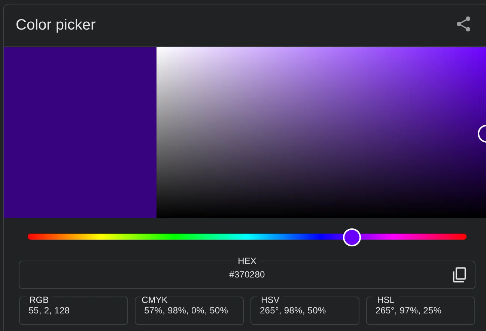
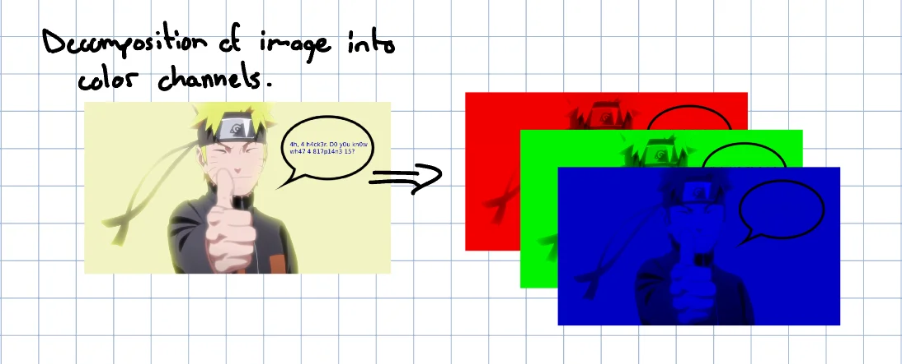
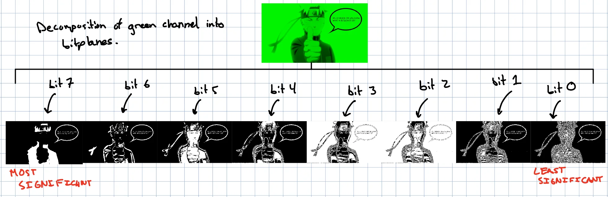
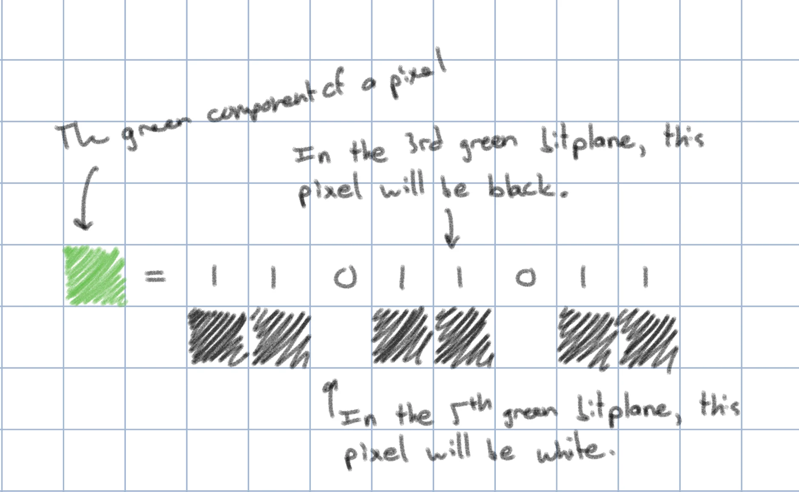
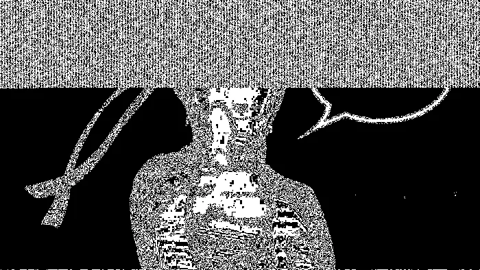

+++
title = "Saichat CTF Writeup"
description = "A guide explaining how to complete the CTF challenge hidden within Saichat."
date = 2025-10-21
lastmod = 2025-10-21
authors = ["Sam Neisewander"]
tags = ["ctf", "steganography"]
draft = false
+++

## A quick Q/A

> What is Saichat?

Saichat is a rudimentary chat application written in C that Leo Molina and I
wrote as an assignment for the class Operating System Principles, taught by
Professor Peter Bui. The application doesn't really have much to do with the
CTF; it is just the starting point.

> What is a CTF?

A CTF is a **C**apture **T**he **F**lag challenge where the author hides a
special string called a "flag" inside some kind of file or server. To retrieve
the flag, you typically apply some cybersecurity or software reverse engineering
concept to extract the string from the file or server. CTF challenges are meant
to be instructive. Good ones generally exercise one's knowledge of computer
science concepts in a way that promotes problem solving through self-discovery.

> How should I read this?

If you'd like an in-depth explanation of this challenge and how to solve it,
continue reading. If you want to try to solve the CTF without the help of this
walkthrough, read the section [Starting the puzzle](#starting-the-puzzle) and
then stop reading.

## Starting the puzzle

_It goes without saying, but don't download and run software from strangers.
Proceed at your own risk!_

Curl Saichat onto an x86 Linux machine, and make it executable with the
following command:

```bash
curl https://irc.samneisewander.com/uploads/24ce1145dba46397/saichat > saichat && chmod +x ./saichat
```

Next, curl the pub/sub server this chat client communicates with:

```bash
curl https://irc.samneisewander.com/uploads/812b4230e94b10db/mq_server.py > mq_server.py
```

Now, start the pub/sub server:

```bash
python3 mq_server.py --port=9005
```

Finally, start Saichat:

```bash
./saichat
```

If you run into dependency problems, install the appropriate libraries using
your distribution's package manager. (You can figure it out! You got this!)

Once the application is running, type in the address of the host running the
server (this would be `localhost` if you are running `mq_server.py` per the
instructions above), the port (likewise, this is `9005` if you followed the
instructions above), and a username. Then, try sending the message "egg" to the
server! This is the beginning of the puzzle.

If you get stuck from here on, read this article for guidance. Happy hunting! 🥚

> ⚠️**WARNING**: The following sections are SPOILERS!!!⚠️

## Solving the riddle

The riddle is a [reference](https://allpoetry.com/Fish-Riddle) to _The Lord of
the Rings_. The answer is `fish`. Once you answer correctly, it should print a
url.

## Solving the image

First of all, Naruto is the best manga ever. Second, this image is giving us a
pretty crucial hint:

> Ah, a hacker. Do you know what a bitplane is?

(I've translated the l33tsp33k for you for convenience.)

### So what is a bitplane?

An image consists of pixels. Let's just consider one pixel.

The color of this pixel is determined by its _red_, _blue_, and _green_ color
channels (also called components). These components are just integer numbers
that describe how much "redness" (or "greenness" or "blueness") the color has.

So I could have a pixel with components `(r: 55, g: 2, b: 128)`, and that looks
like this:



Could I have a pixel with components `(r: 1000000, g: 543, b: 894)`? Well, it
kinda depends.

There is this concept called `bit-depth` which places a cap on how big our
components can be. If our image has a bit-depth of 8 (sometimes said to be an
"8-bit" image), that means that each component is represented using only 8 bits.
Combinatorics tells us that you can create `2^8`, or `256` unique numbers using
8 bits, which means that we can choose one of 256 different amounts of red (and
green, and blue) for our pixel.

So we _could_ have a pixel like `(r: 1000000, g: 543, b: 894)` if we had a
really high bit depth. But for now, let's imagine our pixel is part of an 8-bit
image, meaning its components can range from 0 through 255, inclusive.

Taking our pixel, let's consider only its **red** component. In binary, it looks
like this:

```js
00000000; // 0 in decimal
```

If I flip the rightmost bit, the decimal value goes from zero to one. Small
change. Like who even cares.

```js
00000001; // 1 in decimal
```

But if I then flip the leftmost bit, the decimal value goes from one to _129_.
Thats a big change!!!

```js
10000001; // 129 in decimal
```

We can observe here that the rightmost bit affects the final value the _least_,
so we call it the _least significant bit_. In contrast, the leftmost bit affects
the final value the _most_, so we call it the _most significant bit_. Relating
this to color, flipping the least significant bit causes an almost imperceptible
change the overall "redness" of this pixel, but flipping the most significant
bit causes a very noticeable change in color.

Bitplanes are representations of an image that help us to visualize the effect
of toggling different bits. To create one, we would would first chop our source
image into its different color channels, like this:



Then, for each color channel, we would march over each bit index and make each
pixel in the bitplane black or white based on whether the bit at that index is a
one or a zero:



Here's an example of creating bitplane pixels from the green color channel of
one pixel:



For an 8-bit image with 3 color channels, we would have `8 * 3 = 24` different
bitplanes: one per bit per channel.

Notice how the less significant bitplanes contain more noise than the more
significant ones. This suggests that most of the _information_ that makes the
image visually distinct is found in the more significant bitplanes. If we were
to replace the least significant bitplane with randomly generated noise and then
reassemble the image, we probably wouldn't even notice that anything changed.
This is a critical observation for the purposes of solving this CTF challenge.

### LSB Substitution

This section spoils the whole puzzle, so this is a good place to jump ship if
you'd like to attempt to solve yourself.

The technique used to hide the flag inside this image is called **least
significant bit (LSB) substitution**. Basically, if you can arbitrarily change
the LSBs of any pixel in the image without it really changing the appearance at
all, why not use those bits to hide a file or a message?

LSB substitution (and more generally any technique wherein you conceal data
within other data) comes from a field called
[steganography](https://en.wikipedia.org/wiki/Steganography). One of the biggest
practical applications of steganography is in digital watermarking, though it
has also been used to
[covertly smuggle information](https://codeanddagger.com/news/2018/8/2/engineer-allegedly-hid-stolen-files-in-photo-of-sunset).

You can plainly see that this image of Naruto is being used as a carrier for
some hidden message by looking at the 0th red bitplane:



The noise pattern here is completely bizarre, and suggests that these bits have
been tampered with. Based on this insight, we can write a small utility to
extract the LSBs from the red channel of this image and assemble them into a
binary dump. Inspecting this dump reveals that these bits are actually ASCII
plaintext containing the flag!

I'm not going to show you what's hidden in the image, as that would ruin the
fun. If you've read this far, try extracting the LSBs yourself!
